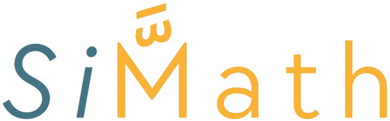

<p align="center">
	
</p>

---
<p align="center">
	
	
	
	
	
</p>

---

## 📖 About

**MMC (Moroccan Mathematical Community)** presents **SiMath**:  
A collaborative, open-source collection of scripts (mainly in Python 3) designed to visually illustrate mathematical concepts, theorems, and algorithms. The project welcomes contributions and aims to be a reference for educators, students, and enthusiasts.

---

## 📁 Repository Structure
```
simath/
│
├── algorithms/
│   ├── <AlgorithmName>/
│   │   ├── <AlgorithmScript>.py
│   │   ├── <AlgorithmDoc>.md
│   │   └── config.yaml (if needed)
│   │   └── __init__.py
│   └── __init__.py
│
├── simulations/
│   ├── linux/
│   │   └── <AlgorithmName>.bash
│   └── windows/
│       └── <AlgorithmName>.bat
│
├── CONTRIBUTION.md
├── README.md
└── requirements.txt
```

---

## 🚀 Quick Start

```sh
# 1. Clone the repository
git clone https://github.com/Moroccan-Mathematical-Community/simath.git
cd simath

# 2. (Optional) Create a virtual environment
python -m venv venv
venv\Scripts\activate  # On Windows
# or
source venv/bin/activate  # On Linux

# 3. Install dependencies
pip install -r requierments.txt

# 4. Run an algorithm simulation  
# On Windows  
simulations\windows\GaussPivot.bat  
simulations\windows\SierpinskiFractal.bat  

# On Linux  
bash simulations/linux/GaussPivot.bash  
bash simulations/linux/SierpinskiFractal.bash  
```

---

## 📋 Algorithms & Theorems

<table align="center">
	<thead>
		<tr>
			<th style="text-align:left;">📝 Name</th>
			<th style="text-align:center;">✅ Implemented</th>
			<th style="text-align:center;">📅 Addition Date</th>
		</tr>
	</thead>
	<tbody>
		<tr>
			<td>Gauss Pivot</td>
			<td align="center"><span style="font-size:1.2em;">✔️</span></td>
			<td align="center">2025-09-07</td>
		</tr>
		<tr>
			<td>Sierpinski Fractal</td>
			<td align="center"><span style="font-size:1.2em;">✔️</span></td>
			<td align="center">2025-09-07</td>
		</tr>
		<tr>
			<td><i>More coming soon...</i></td>
			<td align="center"><span style="font-size:1.2em;">⬜</span></td>
			<td align="center">--</td>
		</tr>
	</tbody>
</table>

---

## 🤝 Contributing

See `CONTRIBUTING.md` for guidelines.  
We welcome new scripts, improvements, and documentation!

---

## 📢 Contact

- **MMC**: [mathmarcom.ma](https://mathmarcom.ma)
- **GitHub**: [Moroccan-Mathematical-Community/simath](https://github.com/Moroccan-Mathematical-Community)
